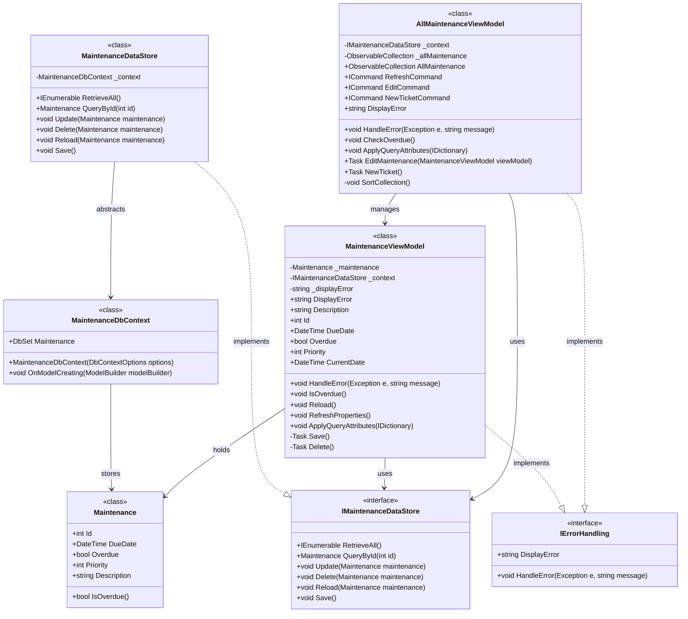

```mermaid
classDiagram
    %% Data
    class MaintenanceDbContext {
        <<class>>
        +DbSet<Maintenance> Maintenance
        +MaintenanceDbContext(DbContextOptions options)
        +void OnModelCreating(ModelBuilder modelBuilder)
    }

    class MaintenanceDataStore {
        <<class>>
        -MaintenanceDbContext _context
        +IEnumerable RetrieveAll()
        +Maintenance QueryById(int id)
        +void Update(Maintenance maintenance)
        +void Delete(Maintenance maintenance)
        +void Reload(Maintenance maintenance)
        +void Save()
    }

    %% Model
    class Maintenance {
        <<class>>
        +int Id
        +DateTime DueDate
        +bool Overdue
        +int Priority
        +string Description
        +bool IsOverdue()
    }

    %% Interfaces
    class IErrorHandling {
        <<interface>>
        +string DisplayError
        +void HandleError(Exception e, string message)
    }

    class IMaintenanceDataStore {
        <<interface>>
        +IEnumerable RetrieveAll()
        +Maintenance QueryById(int id)
        +void Update(Maintenance maintenance)
        +void Delete(Maintenance maintenance)
        +void Reload(Maintenance maintenance)
        +void Save()
    }

    %% ViewModels
    class MaintenanceViewModel {
        <<class>>
        -Maintenance _maintenance
        -IMaintenanceDataStore _context
        -string _displayError
        +string DisplayError
        +string Description
        +int Id
        +DateTime DueDate
        +bool Overdue
        +int Priority
        +DateTime CurrentDate
        +void HandleError(Exception e, string message)
        +void IsOverdue()
        +void Reload()
        +void RefreshProperties()
        +void ApplyQueryAttributes(IDictionary)
        -Task Save()
        -Task Delete()
    }

    class AllMaintenanceViewModel {
        <<class>>
        -IMaintenanceDataStore _context
        -ObservableCollection<MaintenanceViewModel> _allMaintenance
        +ObservableCollection<MaintenanceViewModel> AllMaintenance
        +ICommand RefreshCommand
        +ICommand EditCommand
        +ICommand NewTicketCommand
        +string DisplayError
        +void HandleError(Exception e, string message)
        +void CheckOverdue()
        +void ApplyQueryAttributes(IDictionary)
        +Task EditMaintenance(MaintenanceViewModel viewModel)
        +Task NewTicket()
        -void SortCollection()
    }

    %% Relationships
    MaintenanceDbContext --> Maintenance : stores
    MaintenanceDataStore --> MaintenanceDbContext : abstracts
    MaintenanceDataStore ..|> IMaintenanceDataStore : implements
    MaintenanceViewModel ..|> IErrorHandling : implements
    MaintenanceViewModel --> IMaintenanceDataStore : uses
    AllMaintenanceViewModel --> IMaintenanceDataStore : uses
    AllMaintenanceViewModel ..|> IErrorHandling : implements
    MaintenanceViewModel --> Maintenance : holds
    AllMaintenanceViewModel --> MaintenanceViewModel : manages
```