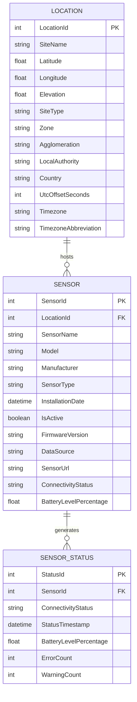

```mermaid
erDiagram
    LOCATION ||--o{ SENSOR : hosts
    SENSOR ||--o{ SENSOR_STATUS : generates
    
    LOCATION {
        int LocationId PK
        string SiteName
        float Latitude
        float Longitude
        float Elevation
        string SiteType
        string Zone
        string Agglomeration
        string LocalAuthority
        string Country
        int UtcOffsetSeconds
        string Timezone
        string TimezoneAbbreviation
    }
    
    SENSOR {
        int SensorId PK
        int LocationId FK
        string SensorName
        string Model
        string Manufacturer
        string SensorType
        datetime InstallationDate
        boolean IsActive
        string FirmwareVersion
        string DataSource
        string SensorUrl
        string ConnectivityStatus
        float BatteryLevelPercentage
    }

    SENSOR_STATUS {
        int StatusId PK
        int SensorId FK
        string ConnectivityStatus
        datetime StatusTimestamp
        float BatteryLevelPercentage
        int ErrorCount
        int WarningCount
    }
```