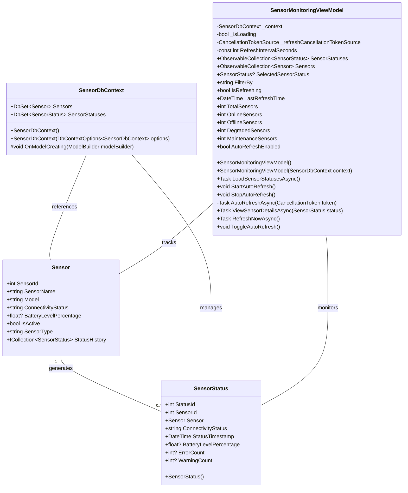

```mermaid
classDiagram
    Sensor "1" -- "0..*" SensorStatus : generates
    SensorDbContext -- SensorStatus : manages
    SensorDbContext -- Sensor : references
    SensorMonitoringViewModel -- SensorStatus : monitors
    SensorMonitoringViewModel -- Sensor : tracks
    
    class Sensor {
        +int SensorId
        +string SensorName
        +string Model
        +string ConnectivityStatus
        +float? BatteryLevelPercentage
        +bool IsActive
        +string SensorType
        +ICollection~SensorStatus~ StatusHistory
    }
    
    class SensorStatus {
        +int StatusId
        +int SensorId
        +Sensor Sensor
        +string ConnectivityStatus
        +DateTime StatusTimestamp
        +float? BatteryLevelPercentage
        +int? ErrorCount
        +int? WarningCount
        +SensorStatus()
    }
    
    class SensorDbContext {
        +DbSet~Sensor~ Sensors
        +DbSet~SensorStatus~ SensorStatuses
        +SensorDbContext()
        +SensorDbContext(DbContextOptions~SensorDbContext~ options)
        #void OnModelCreating(ModelBuilder modelBuilder)
    }
    
    class SensorMonitoringViewModel {
        -SensorDbContext _context
        -bool _isLoading
        -CancellationTokenSource _refreshCancellationTokenSource
        -const int RefreshIntervalSeconds
        +ObservableCollection~SensorStatus~ SensorStatuses
        +ObservableCollection~Sensor~ Sensors
        +SensorStatus? SelectedSensorStatus
        +string FilterBy
        +bool IsRefreshing
        +DateTime LastRefreshTime
        +int TotalSensors
        +int OnlineSensors
        +int OfflineSensors
        +int DegradedSensors
        +int MaintenanceSensors
        +bool AutoRefreshEnabled
        +SensorMonitoringViewModel()
        +SensorMonitoringViewModel(SensorDbContext context)
        +Task LoadSensorStatusesAsync()
        +void StartAutoRefresh()
        +void StopAutoRefresh()
        -Task AutoRefreshAsync(CancellationToken token)
        +Task ViewSensorDetailsAsync(SensorStatus status)
        +Task RefreshNowAsync()
        +void ToggleAutoRefresh()
    }
``` 