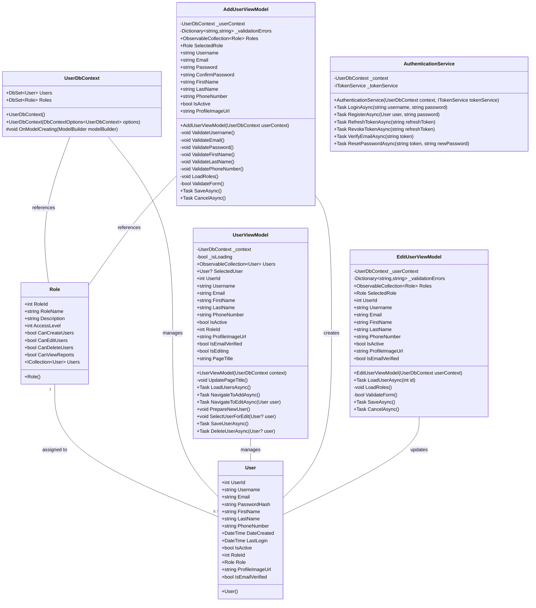

```mermaid
classDiagram
    Role "1" -- "0..*" User : assigned to
    UserDbContext -- User : manages
    UserDbContext -- Role : references
    UserViewModel -- User : manages
    AddUserViewModel -- User : creates
    AddUserViewModel -- Role : references
    EditUserViewModel -- User : updates
    
    class User {
        +int UserId
        +string Username
        +string Email
        +string PasswordHash
        +string FirstName
        +string LastName
        +string PhoneNumber
        +DateTime DateCreated
        +DateTime LastLogin
        +bool IsActive
        +int RoleId
        +Role Role
        +string ProfileImageUrl
        +bool IsEmailVerified
        +User()
    }
    
    class Role {
        +int RoleId
        +string RoleName
        +string Description
        +int AccessLevel
        +bool CanCreateUsers
        +bool CanEditUsers
        +bool CanDeleteUsers
        +bool CanViewReports
        +ICollection~User~ Users
        +Role()
    }
    
    class UserDbContext {
        +DbSet~User~ Users
        +DbSet~Role~ Roles
        +UserDbContext()
        +UserDbContext(DbContextOptions~UserDbContext~ options)
        #void OnModelCreating(ModelBuilder modelBuilder)
    }
    
    class UserViewModel {
        -UserDbContext _context
        -bool _isLoading
        +ObservableCollection~User~ Users
        +User? SelectedUser
        +int UserId
        +string Username
        +string Email
        +string FirstName
        +string LastName
        +string PhoneNumber
        +bool IsActive
        +int RoleId
        +string ProfileImageUrl
        +bool IsEmailVerified
        +bool IsEditing
        +string PageTitle
        +UserViewModel(UserDbContext context)
        -void UpdatePageTitle()
        +Task LoadUsersAsync()
        +Task NavigateToAddAsync()
        +Task NavigateToEditAsync(User user)
        +void PrepareNewUser()
        +void SelectUserForEdit(User? user)
        +Task SaveUserAsync()
        +Task DeleteUserAsync(User? user)
    }
    
    class AddUserViewModel {
        -UserDbContext _userContext
        -Dictionary~string,string~ _validationErrors
        +ObservableCollection~Role~ Roles
        +Role SelectedRole
        +string Username
        +string Email
        +string Password
        +string ConfirmPassword
        +string FirstName
        +string LastName
        +string PhoneNumber
        +bool IsActive
        +string ProfileImageUrl
        +AddUserViewModel(UserDbContext userContext)
        -void ValidateUsername()
        -void ValidateEmail()
        -void ValidatePassword()
        -void ValidateFirstName()
        -void ValidateLastName()
        -void ValidatePhoneNumber()
        -void LoadRoles()
        -bool ValidateForm()
        +Task SaveAsync()
        +Task CancelAsync()
    }
    
    class EditUserViewModel {
        -UserDbContext _userContext
        -Dictionary~string,string~ _validationErrors
        +ObservableCollection~Role~ Roles
        +Role SelectedRole
        +int UserId
        +string Username
        +string Email
        +string FirstName
        +string LastName
        +string PhoneNumber
        +bool IsActive
        +string ProfileImageUrl
        +bool IsEmailVerified
        +EditUserViewModel(UserDbContext userContext)
        +Task LoadUserAsync(int id)
        -void LoadRoles()
        -bool ValidateForm()
        +Task SaveAsync()
        +Task CancelAsync()
    }
    
    class AuthenticationService {
        -UserDbContext _context
        -ITokenService _tokenService
        +AuthenticationService(UserDbContext context, ITokenService tokenService)
        +Task<AuthResult> LoginAsync(string username, string password)
        +Task<AuthResult> RegisterAsync(User user, string password)
        +Task<AuthResult> RefreshTokenAsync(string refreshToken)
        +Task RevokeTokenAsync(string refreshToken)
        +Task<bool> VerifyEmailAsync(string token)
        +Task<bool> ResetPasswordAsync(string token, string newPassword)
    }
``` 