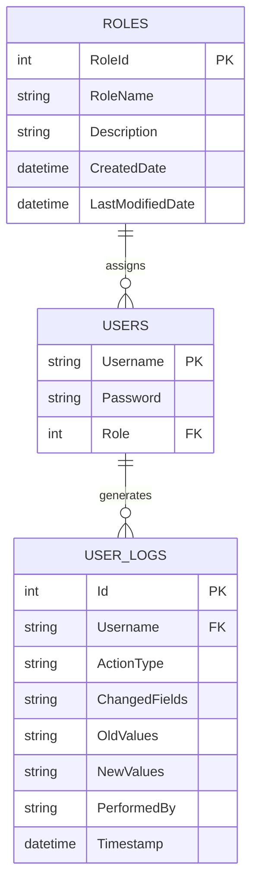

```mermaid
erDiagram
    ROLES ||--o{ USERS : assigns
    USERS ||--o{ USER_LOGS : generates

    USERS {
        string Username PK
        string Password
        int Role FK
    }
    
    ROLES {
        int RoleId PK
        string RoleName
        string Description
        datetime CreatedDate
        datetime LastModifiedDate
    }
    
    USER_LOGS {
        int Id PK
        string Username FK
        string ActionType
        string ChangedFields
        string OldValues
        string NewValues
        string PerformedBy
        datetime Timestamp
    }
```