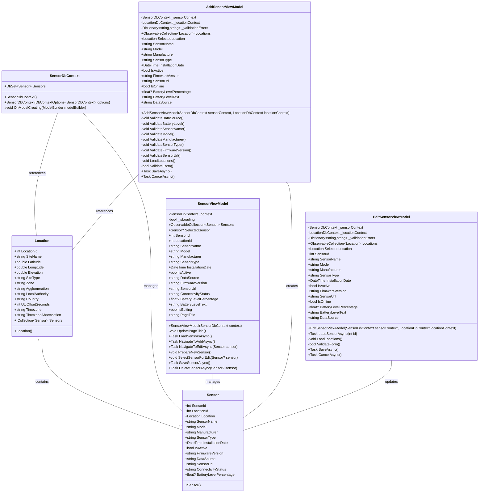

```mermaid
classDiagram
    Location "1" -- "0..*" Sensor : contains
    SensorDbContext -- Sensor : manages
    SensorDbContext -- Location : references
    SensorViewModel -- Sensor : manages
    AddSensorViewModel -- Sensor : creates
    AddSensorViewModel -- Location : references
    EditSensorViewModel -- Sensor : updates
    
    class Location {
        +int LocationId
        +string SiteName
        +double Latitude
        +double Longitude
        +double Elevation
        +string SiteType
        +string Zone
        +string Agglomeration
        +string LocalAuthority
        +string Country
        +int UtcOffsetSeconds
        +string Timezone
        +string TimezoneAbbreviation
        +ICollection~Sensor~ Sensors
        +Location()
    }
    
    class Sensor {
        +int SensorId
        +int LocationId
        +Location Location
        +string SensorName
        +string Model
        +string Manufacturer
        +string SensorType
        +DateTime InstallationDate
        +bool IsActive
        +string FirmwareVersion
        +string DataSource
        +string SensorUrl
        +string ConnectivityStatus
        +float? BatteryLevelPercentage
        +Sensor()
    }
    
    class SensorDbContext {
        +DbSet~Sensor~ Sensors
        +SensorDbContext()
        +SensorDbContext(DbContextOptions~SensorDbContext~ options)
        #void OnModelCreating(ModelBuilder modelBuilder)
    }
    
    class SensorViewModel {
        -SensorDbContext _context
        -bool _isLoading
        +ObservableCollection~Sensor~ Sensors
        +Sensor? SelectedSensor
        +int SensorId
        +int LocationId
        +string SensorName
        +string Model
        +string Manufacturer
        +string SensorType
        +DateTime InstallationDate
        +bool IsActive
        +string DataSource
        +string FirmwareVersion
        +string SensorUrl
        +string ConnectivityStatus
        +float? BatteryLevelPercentage
        +string BatteryLevelText
        +bool IsEditing
        +string PageTitle
        +SensorViewModel(SensorDbContext context)
        -void UpdatePageTitle()
        +Task LoadSensorsAsync()
        +Task NavigateToAddAsync()
        +Task NavigateToEditAsync(Sensor sensor)
        +void PrepareNewSensor()
        +void SelectSensorForEdit(Sensor? sensor)
        +Task SaveSensorAsync()
        +Task DeleteSensorAsync(Sensor? sensor)
    }
    
    class AddSensorViewModel {
        -SensorDbContext _sensorContext
        -LocationDbContext _locationContext
        -Dictionary~string,string~ _validationErrors
        +ObservableCollection~Location~ Locations
        +Location SelectedLocation
        +string SensorName
        +string Model
        +string Manufacturer
        +string SensorType
        +DateTime InstallationDate
        +bool IsActive
        +string FirmwareVersion
        +string SensorUrl
        +bool IsOnline
        +float? BatteryLevelPercentage
        +string BatteryLevelText
        +string DataSource
        +AddSensorViewModel(SensorDbContext sensorContext, LocationDbContext locationContext)
        -void ValidateDataSource()
        -void ValidateBatteryLevel()
        -void ValidateSensorName()
        -void ValidateModel()
        -void ValidateManufacturer()
        -void ValidateSensorType()
        -void ValidateFirmwareVersion()
        -void ValidateSensorUrl()
        -void LoadLocations()
        -bool ValidateForm()
        +Task SaveAsync()
        +Task CancelAsync()
    }
    
    class EditSensorViewModel {
        -SensorDbContext _sensorContext
        -LocationDbContext _locationContext
        -Dictionary~string,string~ _validationErrors
        +ObservableCollection~Location~ Locations
        +Location SelectedLocation
        +int SensorId
        +string SensorName
        +string Model
        +string Manufacturer
        +string SensorType
        +DateTime InstallationDate
        +bool IsActive
        +string FirmwareVersion
        +string SensorUrl
        +bool IsOnline
        +float? BatteryLevelPercentage
        +string BatteryLevelText
        +string DataSource
        +EditSensorViewModel(SensorDbContext sensorContext, LocationDbContext locationContext)
        +Task LoadSensorAsync(int id)
        -void LoadLocations()
        -bool ValidateForm()
        +Task SaveAsync()
        +Task CancelAsync()
    }
```
