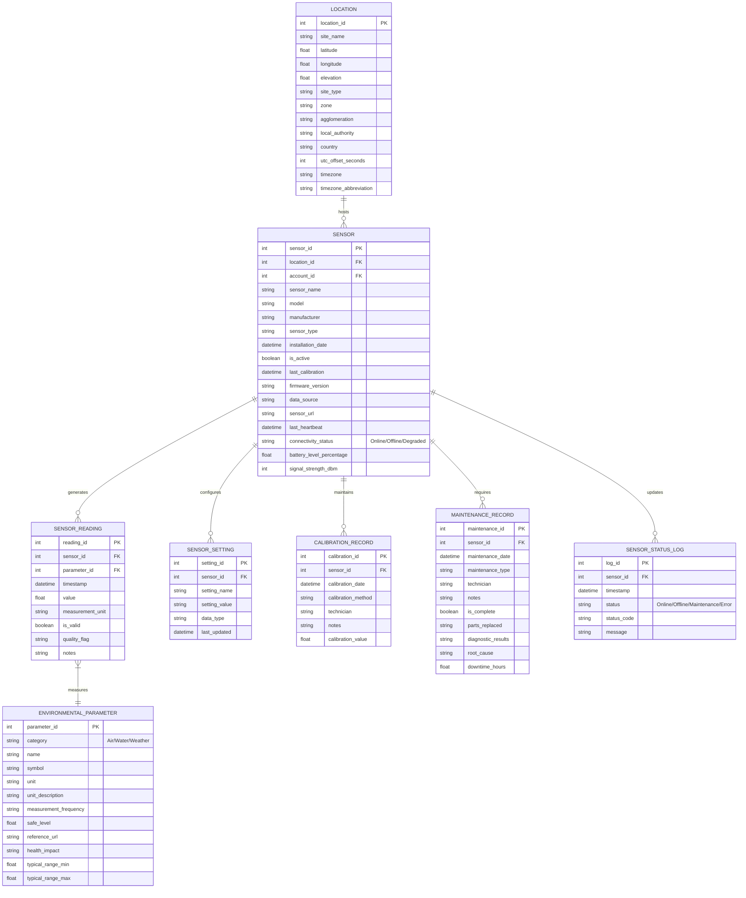

```mermaid
erDiagram
    SENSOR ||--o{ SENSOR_READING : generates
    SENSOR_READING }|--|| ENVIRONMENTAL_PARAMETER : measures
    SENSOR ||--o{ SENSOR_SETTING : configures
    SENSOR ||--o{ CALIBRATION_RECORD : maintains
    SENSOR ||--o{ MAINTENANCE_RECORD : requires
    SENSOR ||--o{ SENSOR_STATUS_LOG : updates
    LOCATION ||--o{ SENSOR : hosts
    
    LOCATION {
        int location_id PK
        string site_name
        float latitude
        float longitude
        float elevation
        string site_type
        string zone
        string agglomeration
        string local_authority
        string country
        int utc_offset_seconds
        string timezone
        string timezone_abbreviation
    }
    
    SENSOR {
        int sensor_id PK
        int location_id FK
        int account_id FK
        string sensor_name
        string model
        string manufacturer
        string sensor_type
        datetime installation_date
        boolean is_active
        datetime last_calibration
        string firmware_version
        string data_source
        string sensor_url
        datetime last_heartbeat
        string connectivity_status "Online/Offline/Degraded"
        float battery_level_percentage
        int signal_strength_dbm
    }
    
    SENSOR_READING {
        int reading_id PK
        int sensor_id FK
        int parameter_id FK
        datetime timestamp
        float value
        string measurement_unit
        boolean is_valid
        string quality_flag
        string notes
    }
    
    ENVIRONMENTAL_PARAMETER {
        int parameter_id PK
        string category "Air/Water/Weather"
        string name
        string symbol
        string unit
        string unit_description
        string measurement_frequency
        float safe_level
        string reference_url
        string health_impact
        float typical_range_min
        float typical_range_max
    }
    
    SENSOR_SETTING {
        int setting_id PK
        int sensor_id FK
        string setting_name
        string setting_value
        string data_type
        datetime last_updated
    }
    
    CALIBRATION_RECORD {
        int calibration_id PK
        int sensor_id FK
        datetime calibration_date
        string calibration_method
        string technician
        string notes
        float calibration_value
    }
    
    MAINTENANCE_RECORD {
        int maintenance_id PK
        int sensor_id FK
        datetime maintenance_date
        string maintenance_type
        string technician
        string notes
        boolean is_complete
        string parts_replaced
        string diagnostic_results
        string root_cause
        float downtime_hours
    }
    
    SENSOR_STATUS_LOG {
        int log_id PK
        int sensor_id FK
        datetime timestamp
        string status "Online/Offline/Maintenance/Error"
        string status_code
        string message
    }
```