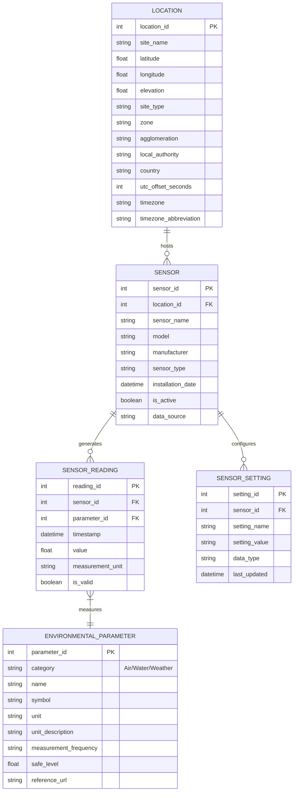

```mermaid
erDiagram
    SENSOR ||--o{ SENSOR_READING : generates
    SENSOR_READING }|--|| ENVIRONMENTAL_PARAMETER : measures
    SENSOR ||--o{ SENSOR_SETTING : configures
    LOCATION ||--o{ SENSOR : hosts
    
    LOCATION {
        int location_id PK
        string site_name
        float latitude
        float longitude
        float elevation
        string site_type
        string zone
        string agglomeration
        string local_authority
        string country
        int utc_offset_seconds
        string timezone
        string timezone_abbreviation
    }
    
    SENSOR {
        int sensor_id PK
        int location_id FK
        string sensor_name
        string model
        string manufacturer
        string sensor_type
        datetime installation_date
        boolean is_active
        string data_source
    }
    
    SENSOR_READING {
        int reading_id PK
        int sensor_id FK
        int parameter_id FK
        datetime timestamp
        float value
        string measurement_unit
        boolean is_valid
    }
    
    ENVIRONMENTAL_PARAMETER {
        int parameter_id PK
        string category "Air/Water/Weather"
        string name
        string symbol
        string unit
        string unit_description
        string measurement_frequency
        float safe_level
        string reference_url
    }
    
    SENSOR_SETTING {
        int setting_id PK
        int sensor_id FK
        string setting_name
        string setting_value
        string data_type
        datetime last_updated
    }
```