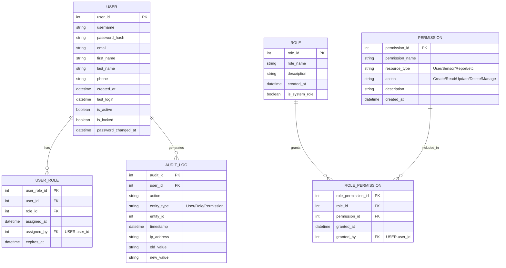

```mermaid
erDiagram
    USER ||--o{ USER_ROLE : has
    ROLE ||--o{ ROLE_PERMISSION : grants
    PERMISSION ||--o{ ROLE_PERMISSION : included_in
    USER ||--o{ AUDIT_LOG : generates
    
    USER {
        int user_id PK
        string username
        string password_hash
        string email
        string first_name
        string last_name
        string phone
        datetime created_at
        datetime last_login
        boolean is_active
        boolean is_locked
        datetime password_changed_at
    }
    
    ROLE {
        int role_id PK
        string role_name
        string description
        datetime created_at
        boolean is_system_role
    }
    
    USER_ROLE {
        int user_role_id PK
        int user_id FK
        int role_id FK
        datetime assigned_at
        int assigned_by FK "USER.user_id"
        datetime expires_at
    }
    
    PERMISSION {
        int permission_id PK
        string permission_name
        string resource_type "User/Sensor/Report/etc"
        string action "Create/Read/Update/Delete/Manage"
        string description
        datetime created_at
    }
    
    ROLE_PERMISSION {
        int role_permission_id PK
        int role_id FK
        int permission_id FK
        datetime granted_at
        int granted_by FK "USER.user_id"
    }
    
    AUDIT_LOG {
        int audit_id PK
        int user_id FK
        string action
        string entity_type "User/Role/Permission"
        int entity_id
        datetime timestamp
        string ip_address
        string old_value
        string new_value
    }
```